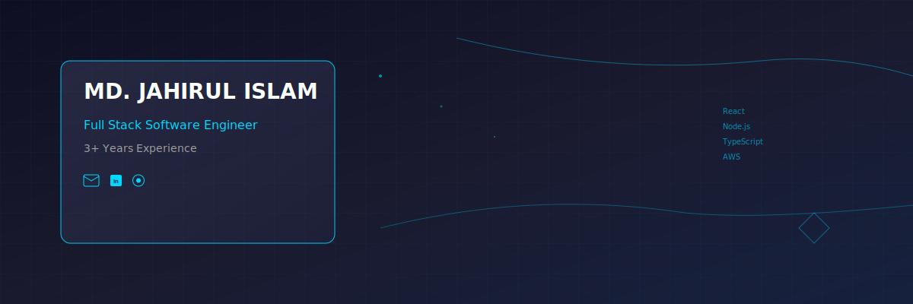

  

  

---

## About Me

I'm a dedicated **Full Stack Software Engineer** with **3+ years of professional experience** specializing in modern JavaScript technologies and scalable web applications. Currently building innovative solutions at **Periscope Digital**, I bring a unique combination of technical expertise and content creation skills from my background in digital media.

**Vision:** Leveraging cutting-edge technologies to build impactful software solutions that solve real-world problems while maintaining exceptional user experience.

---

## Technical Skills

**Languages**  

**Frontend**  

**Backend**  

**Databases**  

**DevOps & Cloud**  

---

## Professional Experience

### Software Engineer • Periscope Digital

**July 2022 - Present**

- Developed and maintained scalable backend systems using NestJS and Node.js
- Designed and implemented robust database schemas for SQL and NoSQL databases
- Automated deployment processes using Docker and CI/CD pipelines
- Conducted comprehensive code reviews and testing to ensure high-quality deliverables

### Software Engineer - Intern • Nodecandy

**January 2022 - June 2022**

- Built RESTful APIs and backend services using Node.js, Express.js, and MongoDB
- Collaborated on full-stack applications using Next.js, React.js, and Redux Toolkit
- Deployed applications and optimized workflows with CI/CD pipelines and VPS hosting

### Content Writer & Website Maintainer • Sports Castle

**February 2018 - March 2020 • Part-time**

- Created engaging sports features, news articles, and match reports for web publication
- Maintained and updated website content ensuring seamless functionality
- Managed social media presence including Facebook page content and sports statistics
- Contributed to platform growth through consistent quality content delivery

---

## Education

**Bachelor of Science in Computer Science & Engineering**  
Daffodil International University • 2022

---

## Key Projects

- **NFC-based Smart Business Cards** - Developed innovative solution with passwordless login system
- **Hotel & Resort Booking System** - Designed and implemented comprehensive booking platform
- **Database Architecture** - Strong expertise in designing efficient SQL and NoSQL database schemas
- **AI Applications** - Hands-on experience with AI technologies during academic projects

---

## GitHub Statistics

  

---

**"Building the future, one line of code at a time"**

