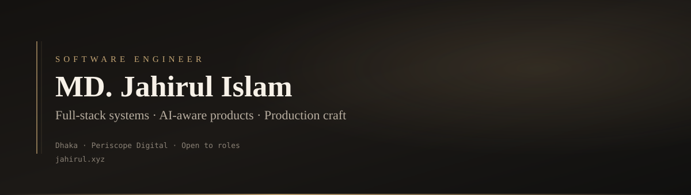

  

 

  
  &nbsp;&nbsp;
  
  &nbsp;&nbsp;
  

 

  

### Profile

Full-stack engineer with **3+ years** shipping production web applications — from polished React/Next.js interfaces to resilient Node.js backends and data layers. I care about clean architecture, measurable performance, and products that feel intentional.

Currently at **Periscope Digital**, with selective contract work on AI-assisted platforms, payments, and offline-capable systems. Based in Dhaka. Open to engineering roles.

  

### Experience

**Software Engineer** · Periscope Digital  
`Jan 2024 — Present`  
Client applications and internal platforms — React/Next.js UI, Node APIs, integrations, and deployment automation.

**Software Engineer (Contract)** · Express Web Agency  
`Apr 2026 — Present`  
Real-time streaming interfaces, Stripe subscription flows, and offline sync with Next.js and Supabase.

**Full-Stack Developer (Contract)** · EncephalonTech  
`Mar 2026 — May 2026`  
AI-assisted career/document platform — rich-text editors, template APIs, and high-fidelity PDF export.

**Software Engineer Intern** · Nodecandy  
`Jul 2023 — Dec 2023`  
Frontend/backend feature work, VPS deploys, and early CI/CD with React, Next.js, and Node.js.

  

### Toolkit

**Languages & Frontend**

 

  

**Backend & APIs**

 

&nbsp;

  

**Data**

 

&nbsp;

  

**Cloud, AI & Delivery**

 

&nbsp;

&nbsp;

  

### Selected Work

**[Hirameki Whiteboard](https://github.com/abir-islam-z/hirameki-whiteboard)** — Swift  
Native macOS vector whiteboard with PDF annotation.

**[Express Modular CLI](https://github.com/abir-islam-z/express-cli)** — TypeScript  
Scaffolding for modular Express backends.

**[Node.js Boilerplate](https://github.com/abir-islam-z/nodejs-boilerplate)** — TypeScript  
Production-minded Node starter for faster project kickoff.

**Shipped products** — OrbCards · EasyStay · Kaju and more on [jahirul.xyz](https://jahirul.xyz)

  

### Activity

  
  

 

  

  B.Sc. Computer Science & Engineering · Daffodil International University
    
  <a href="mailto:hello@jahirul.xyz">hello@jahirul.xyz</a>
  &nbsp;·&nbsp;
  <a href="https://jahirul.xyz">jahirul.xyz</a>
  &nbsp;·&nbsp;
  <a href="https://www.linkedin.com/in/jahirul-islam-abir/">LinkedIn</a>

